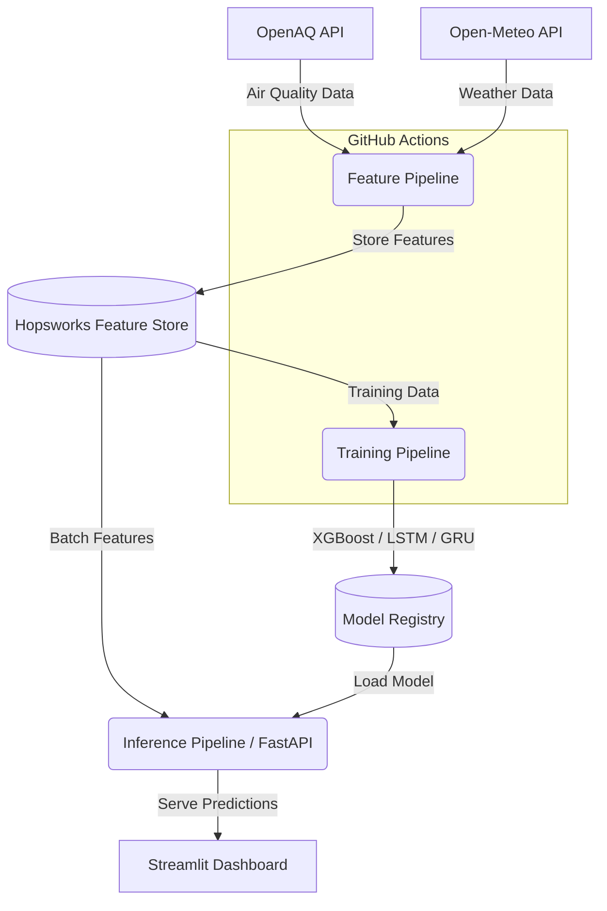

# 🫧 As Clear as Pearl

> Serverless AQI prediction system for Lahore, Pakistan.


Lahore frequently experiences severe air pollution and smog, especially during the winter months. **As Clear as Pearl** is a machine learning pipeline that predicts Air Quality Index (AQI) up to 72 hours in advance, providing actionable health alerts.

## 🏗️ Architecture



## ✨ Features

- **Serverless Architecture**: Feature and training pipelines run automatically on GitHub Actions.
- **Hopsworks Integration**: Centralized feature store and model registry.
- **Multi-Model Comparison**: Evaluates XGBoost, LSTM, and GRU networks.
- **Explainable AI**: SHAP integration for understanding feature importance.
- **Stunning UI**: Premium dark-themed dashboard with glassmorphism and interactive Plotly charts.
- **Health Alerts**: Context-aware recommendations based on predicted AQI levels.

## 🚀 Setup

1. **Clone the repository:**
   ```bash
   git clone https://github.com/yourusername/as-clear-as-pearl.git
   cd as-clear-as-pearl
   ```

2. **Install dependencies:**
   ```bash
   python -m venv venv
   source venv/bin/activate  # On Windows: venv\Scripts\activate
   pip install -r requirements.txt
   ```

3. **Configure Environment:**
   Create a `.env` file in the root directory:
   ```env
   OPENAQ_API_KEY=your_openaq_key
   HOPSWORKS_API_KEY=your_hopsworks_key
   HOPSWORKS_PROJECT_NAME=your_project_name
   ```

## 💻 Usage

### Run Pipelines Locally
```bash
# Extract features and push to Hopsworks
python -m src.feature_pipeline

# Train models and save to registry
python -m src.training_pipeline
```

### Launch the App
1. **Start the FastAPI Backend:**
   ```bash
   uvicorn src.api:app --reload --port 8000
   ```

2. **Start the Streamlit Dashboard:**
   ```bash
   streamlit run src/app.py
   ```

## 📂 Project Structure

```text
as-clear-as-pearl/
├── .github/
│   └── workflows/
│       ├── feature_pipeline.yml
│       └── training_pipeline.yml
├── data/                  # Local data storage
├── notebooks/
│   └── eda.py             # Exploratory Data Analysis
├── src/
│   ├── app.py             # Streamlit Dashboard
│   ├── config.py          # Central configuration
│   ├── feature_pipeline.py
│   ├── training_pipeline.py
│   └── api.py             # FastAPI backend
└── README.md
```

## 📸 Screenshots

*(Add screenshots of the dashboard here)*

## 📄 License

This project is licensed under the MIT License - see the LICENSE file for details.
