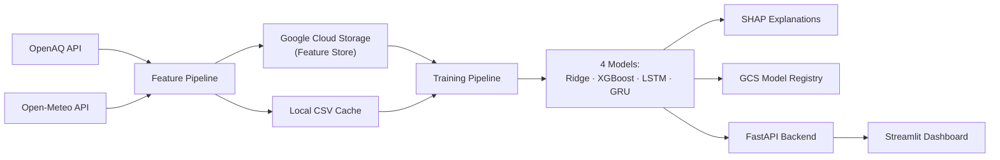

# 🫧 As Clear as Pearl

**Lahore Air Quality Index (AQI) Prediction & Intelligence System**

[](https://share.streamlit.io)
[](https://python.org)
[](https://tensorflow.org)
[](https://xgboost.readthedocs.io)
[](https://cloud.google.com/vertex-ai)

> Predicts Lahore's AQI for the next **3 days** (72 hours) using 4 ML/DL models, powered by a fully serverless CI/CD pipeline.

---

## Architecture



## 🚀 Live Demo

The dashboard is deployed on **Streamlit Community Cloud**:
- Premium dark theme with glassmorphism UI
- 5 interactive tabs: Live Dashboard, EDA, Model Comparison, SHAP, Alerts

## Tech Stack

| Layer | Technology |
|-------|-----------|
| **ML Models** | Scikit-learn (Ridge), XGBoost, TensorFlow (LSTM, GRU) |
| **Feature Store** | Google Cloud Storage (Vertex AI free tier) |
| **Explainability** | SHAP (Linear, Tree, Gradient Explainers) |
| **API** | FastAPI |
| **Dashboard** | Streamlit + Plotly |
| **CI/CD** | GitHub Actions (hourly features, daily training) |
| **Data Sources** | OpenAQ (air quality), Open-Meteo (weather) |

## Quick Start

### 1. Install
```bash
pip install -r requirements-full.txt
```

### 2. Configure `.env`
```env
OPENAQ_API_KEY=your_key
GCP_PROJECT_ID=your_project        # optional — works without GCP
GCS_BUCKET_NAME=your_bucket        # optional — falls back to local CSV
```

### 3. Bootstrap data & train
```bash
python -m src.feature_pipeline --backfill --days 365
python -m src.training_pipeline --use-local
```

### 4. Launch
```bash
streamlit run src/app.py
```

## 📂 Project Structure

```
src/
├── config.py                  # Central config (AQI breakpoints, model params)
├── data_fetcher.py            # OpenAQ + Open-Meteo API clients
├── feature_engineering.py     # 30+ engineered features
├── feature_pipeline.py        # Fetch → Engineer → Store (GCS/local)
├── training_pipeline.py       # Train 4 models, compare, save
├── inference_pipeline.py      # 72-hour AQI predictions
├── explainability.py          # SHAP analysis for all models
├── alerts.py                  # 6-level AQI alert system
├── api.py                     # FastAPI (7 endpoints)
├── app.py                     # Streamlit dashboard
└── models/
    ├── linear_regression_model.py
    ├── xgboost_model.py
    ├── lstm_model.py
    └── gru_model.py
```

## 📖 Documentation

See [DOCUMENTATION.md](documentation/DOCUMENTATION.md) for the complete 20-section walkthrough covering problem statement, architecture, feature engineering, model training, SHAP analysis, deployment, and requirement traceability.

## License

MIT
