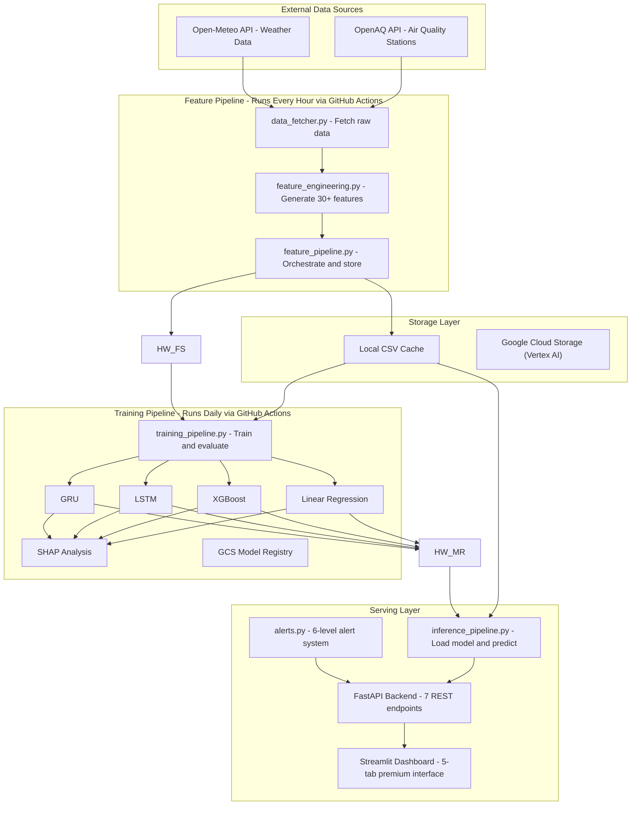

# As Clear as Pearl — Complete Project Documentation

## Lahore AQI Prediction & Intelligence System

---

# Table of Contents

1. [Problem Statement & The Gap It Fills](#1-problem-statement--the-gap-it-fills)
2. [What This Project Does](#2-what-this-project-does)
3. [Solution Architecture](#3-solution-architecture)
4. [Tech Stack & Justification](#4-tech-stack--justification)
5. [Data Sources & Collection](#5-data-sources--collection)
6. [Feature Engineering — Turning Raw Data Into Intelligence](#6-feature-engineering--turning-raw-data-into-intelligence)
7. [Model Training — Four Approaches Compared](#7-model-training--four-approaches-compared)
8. [Model Explainability — SHAP Analysis](#8-model-explainability--shap-analysis)
9. [Inference Pipeline — Generating 3-Day Forecasts](#9-inference-pipeline--generating-3-day-forecasts)
10. [AQI Alert System](#10-aqi-alert-system)
11. [FastAPI Backend — REST API](#11-fastapi-backend--rest-api)
12. [Streamlit Dashboard — Interactive Frontend](#12-streamlit-dashboard--interactive-frontend)
13. [CI/CD Automation — GitHub Actions](#13-cicd-automation--github-actions)
14. [Vertex AI Feature Store — Google Cloud Storage](#14-vertex-ai-feature-store--google-cloud-storage)
15. [Exploratory Data Analysis (EDA)](#15-exploratory-data-analysis-eda)
16. [Project File Map — What Lives Where](#16-project-file-map--what-lives-where)
17. [How to Run the Project](#17-how-to-run-the-project)
18. [Troubleshooting — Common Issues & Fixes](#18-troubleshooting--common-issues--fixes)
19. [Deployment — Streamlit Community Cloud](#19-deployment--streamlit-community-cloud)
20. [Requirement Traceability Matrix](#20-requirement-traceability-matrix)

---

# 1. Problem Statement & The Gap It Fills

## The Problem

Lahore, Pakistan consistently ranks among the **most polluted cities in the world**. During the smog season (October–February), the Air Quality Index (AQI) regularly exceeds 300 — the "Hazardous" threshold — posing severe health risks to over 13 million residents. Citizens face:

- **No advance warning** — Most AQI tools only show *current* conditions, not what's coming tomorrow or the day after.
- **No local prediction models** — Global air quality platforms provide generic readings but don't account for Lahore's unique pollution dynamics (crop burning in Punjab, brick kilns, traffic patterns, temperature inversions).
- **No actionable health guidance** — Knowing the AQI is 350 means nothing if people don't understand what to *do* about it.
- **Scattered, inaccessible data** — Air quality data from monitoring stations exists, but it's buried in technical APIs that ordinary citizens and even most professionals cannot access.

## The Gap This Project Fills

**"As Clear as Pearl"** bridges these gaps by delivering:

| Gap | Our Solution |
|-----|-------------|
| No forecasting | **3-day hourly AQI predictions** using 4 trained ML/DL models |
| No local models | Models trained on **1 year of Lahore-specific historical data** from real monitoring stations |
| No explanations | **SHAP-powered feature importance** showing *why* AQI is predicted to spike (e.g., PM2.5, low wind speed, winter season) |
| No actionable advice | **6-level alert system** with specific health recommendations per severity tier |
| Scattered data | **Single interactive dashboard** with real-time AQI, forecasts, trends, and analytics |
| Manual processes | **Fully automated serverless pipeline** — data refreshes hourly, models retrain daily, zero human intervention required |

> In short: this project transforms raw environmental sensor data into a complete, automated, intelligent air quality prediction and advisory system.

---

# 2. What This Project Does

At a high level, the system performs five core functions in a continuous automated loop:

```
+------------+     +----------------+     +--------------+     +-------------+     +--------------+
|  COLLECT   | --> |   ENGINEER     | --> |    TRAIN     | --> |   PREDICT   | --> |   PRESENT    |
|  Raw Data  |     |   Features     |     |   4 Models   |     |  3-Day AQI  |     |  Dashboard   |
+------------+     +----------------+     +--------------+     +-------------+     +--------------+
  Every Hour         30+ Features          Daily Retrain       72-Hour Horizon      5-Tab Interface
```

1. **COLLECT** — Fetches air quality measurements (PM2.5, PM10, O3, NO2, SO2, CO) from OpenAQ monitoring stations near Lahore, and weather data (temperature, humidity, wind, pressure) from the Open-Meteo API.

2. **ENGINEER** — Transforms raw readings into 30+ meaningful features: time-of-day patterns, seasonal indicators, rolling averages, rate-of-change metrics, wind vectors, and a composite pollution index.

3. **TRAIN** — Trains four different prediction models (Linear Regression, XGBoost, LSTM, GRU), evaluates each on held-out test data, compares their performance, and runs SHAP explainability analysis.

4. **PREDICT** — Uses the best-performing model to generate AQI predictions for the next 72 hours (3 days), hour by hour.

5. **PRESENT** — Displays everything on a premium interactive dashboard: live AQI, forecasts, historical trends, model comparisons, feature importance charts, and health alerts.

---

# 3. Solution Architecture



### Data Flow Summary

| Step | What Happens | When | Where |
|------|-------------|------|-------|
| 1. Fetch | Raw pollutant concentrations + weather readings pulled from APIs | Every hour | `data_fetcher.py` |
| 2. Engineer | 30+ features generated (AQI, time patterns, rolling stats, derived) | Every hour | `feature_engineering.py` |
| 3. Store | Engineered features saved locally + pushed to GCS (Vertex AI) | Every hour | `feature_pipeline.py` |
| 4. Train | All 4 models trained on latest data, compared, and best is saved | Every day | `training_pipeline.py` |
| 5. Explain | SHAP analysis run on all models, plots generated | Every day | `explainability.py` |
| 6. Predict | Best model generates 72-hour AQI forecast | On demand | `inference_pipeline.py` |
| 7. Serve | REST API exposes predictions, alerts, and analytics | Always on | `api.py` |
| 8. Display | Dashboard visualizes everything interactively | Always on | `app.py` |

---

# 4. Tech Stack & Justification

Every technology in the stack was chosen deliberately:

| Technology | Role | Why This Choice |
|-----------|------|----------------|
| **Python** | Core language | Industry standard for ML/data science. Rich ecosystem. |
| **Scikit-learn** | Linear Regression model + preprocessing | Gold standard for classical ML. Ridge regression + StandardScaler pipeline. |
| **XGBoost** | Gradient boosting model | Best-in-class for tabular data. Handles missing values, feature importance built-in. |
| **TensorFlow / Keras** | LSTM and GRU models | Production-grade deep learning framework. Keras API makes sequence models clean and readable. |
| **Vertex AI / GCS** (Free Tier) | Feature Store + Model Registry | Centralized feature management prevents training-serving skew. Model versioning. Free tier = serverless-friendly. **No raw data stored** (only engineered features) to stay within free tier limits. |
| **GitHub Actions** | CI/CD pipeline automation | Free for public repos. Cron scheduling for hourly/daily pipelines. Zero infrastructure to manage. |
| **Streamlit** | Interactive dashboard frontend | Rapid UI development. Rich widget library. Built-in caching. Free cloud deployment available. |
| **FastAPI** | REST API backend | Async-capable, auto-generated docs (Swagger), type-validated endpoints. |
| **OpenAQ API** | Air quality data source | Real monitoring station measurements from Lahore (not model estimates). Free with API key. |
| **Open-Meteo API** | Weather data source | Completely free (no API key needed). Historical + forecast weather. Reliable hourly data. |
| **SHAP** | Model explainability | Theoretically grounded (Shapley values from game theory). Works with all 4 model types. Visual output. |

### Serverless Architecture

The entire stack is **100% serverless** — no servers to provision, maintain, or pay for:

- **Compute**: GitHub Actions runners (free) execute the pipelines
- **Storage**: Google Cloud Storage (always-free 5GB tier) stores features and models
- **API**: FastAPI deployed to a serverless platform
- **Dashboard**: Streamlit deploys to Streamlit Community Cloud (free)

---

# 5. Data Sources & Collection

> **File**: `src/data_fetcher.py`

## 5.1 Air Quality Data — OpenAQ

The `OpenAQClient` class fetches real air quality measurements from monitoring stations near Lahore (within a 25 km radius).

**What is fetched:**

| Pollutant | Symbol | Unit | Health Significance |
|-----------|--------|------|-------------------|
| Fine Particulate Matter | PM2.5 | ug/m3 | Penetrates deep into lungs. Primary driver of Lahore's hazardous AQI. |
| Coarse Particulate Matter | PM10 | ug/m3 | Dust, pollen, construction debris. |
| Ozone | O3 | ug/m3 | Forms from sunlight reacting with vehicle/industrial emissions. |
| Nitrogen Dioxide | NO2 | ug/m3 | Traffic exhaust. Respiratory irritant. |
| Sulfur Dioxide | SO2 | ug/m3 | Industrial emissions, brick kilns. |
| Carbon Monoxide | CO | ug/m3 | Incomplete combustion. Vehicle exhaust. |

**How it works:**
1. `find_locations()` — Searches OpenAQ for monitoring stations near Lahore's coordinates (31.5204 N, 74.3587 E)
2. `fetch_historical_data(days=365)` — Fetches 1 year of hourly data in 30-day batches (to avoid API timeouts), with 1-second delays between requests for rate limiting
3. `fetch_latest()` — Gets the most recent 24 hours of readings for live dashboard display
4. Results are cached locally to `data/openaq_cache.csv` to avoid redundant API calls

## 5.2 Weather Data — Open-Meteo

The `WeatherClient` class fetches weather data that directly influences air quality:

| Variable | Internal Name | Unit | Why It Matters for AQI |
|----------|--------------|------|----------------------|
| Temperature | `temperature` | C | Cold temperature inversions trap pollutants near ground level |
| Humidity | `humidity` | % | High humidity accelerates formation of secondary particulate matter |
| Dew Point | `dew_point` | C | Indicates moisture content affecting particle chemistry |
| Atmospheric Pressure | `pressure` | hPa | High pressure systems cause air stagnation and pollution buildup |
| Cloud Cover | `cloud_cover` | % | Affects UV-driven ozone formation |
| Wind Speed | `wind_speed` | m/s | Higher wind disperses pollutants — key predictor |
| Wind Direction | `wind_direction` | degrees | Identifies upwind pollution sources (crop burning areas) |
| Wind Gusts | `wind_gusts` | m/s | Sudden dust resuspension |
| Precipitation | `precipitation` | mm | Rain washes particulates from the air ("wet deposition") |

**How it works:**
1. `fetch_historical_weather(start, end)` — Fetches historical hourly data in 90-day chunks from the Open-Meteo archive API
2. `fetch_forecast_weather()` — Fetches the next 5 days of hourly weather forecasts for the prediction pipeline

## 5.3 Data Merging

The top-level function `fetch_all_historical(days=365)`:
1. Calls both OpenAQ and Open-Meteo clients
2. Merges the two DataFrames on the `datetime` column (hourly alignment)
3. Forward-fills and interpolates any missing values
4. Returns a single unified DataFrame with all pollutant + weather columns

---

# 6. Feature Engineering — Turning Raw Data Into Intelligence

> **File**: `src/feature_engineering.py`

Raw sensor readings alone are not enough for accurate predictions. The `engineer_features()` function transforms the merged data into **30+ meaningful features** across four categories:

## 6.1 AQI Calculation (Target Variable)

The system calculates the **US EPA Air Quality Index** (0-500 scale) using the standard piecewise linear interpolation formula. For each pollutant, the formula maps its concentration to a 0-500 index using EPA breakpoint tables. The **overall AQI** equals the maximum sub-index across all pollutants. In Lahore, PM2.5 is almost always the dominant pollutant.

> This formula is implemented in `config.py -> calculate_overall_aqi()` and applied row-by-row in the feature engineering step.

## 6.2 Time-Based Features

Air quality follows strong temporal patterns — pollution is worse during rush hours, winter months, and weekdays.

| Feature | What It Captures | Formula / Logic |
|---------|-----------------|----------------|
| `hour` (0-23) | Daily pollution cycle (rush hours vs. night) | `datetime.hour` |
| `day_of_week` (0-6) | Weekday vs. weekend traffic patterns | `datetime.weekday()` |
| `month` (1-12) | Seasonal patterns (Oct-Feb = smog season) | `datetime.month` |
| `day_of_year` (1-366) | Annual cycle position | `datetime.dayofyear` |
| `is_weekend` (0/1) | Binary flag for reduced industrial/traffic activity | 1 if Saturday or Sunday |
| `hour_sin`, `hour_cos` | Cyclical encoding of hour (so 23:00 is close to 00:00) | sin(2*pi * hour / 24), cos(2*pi * hour / 24) |
| `month_sin`, `month_cos` | Cyclical encoding of month (so December is close to January) | sin(2*pi * (month-1) / 12), cos(...) |
| `season` (0-3) | Spring=0, Summer=1, Autumn=2, **Winter=3** (most critical for Lahore) | Based on month |

## 6.3 Derived Features

These capture dynamics and interactions that raw readings miss:

| Feature | What It Captures | Calculation |
|---------|-----------------|-------------|
| `aqi_change_rate` | How fast is air quality deteriorating or improving? | Current AQI - previous hour's AQI |
| `aqi_rolling_mean_6h` | Short-term AQI trend | 6-hour rolling average |
| `aqi_rolling_mean_24h` | Daily AQI baseline | 24-hour rolling average |
| `aqi_rolling_std_24h` | AQI volatility (stability vs. wild swings) | 24-hour rolling standard deviation |
| `pm25_pm10_ratio` | Pollution source type indicator | PM2.5 / PM10 (high ratio = combustion sources; low = dust) |
| `wind_x` | West-East wind component | wind_speed * cos(direction * pi / 180) |
| `wind_y` | South-North wind component | wind_speed * sin(direction * pi / 180) |
| `temp_humidity_interaction` | Combined meteorological effect | temperature * humidity / 100 |
| `pollution_index` | Composite pollution severity score | Weighted normalized sum: PM2.5 (30%), PM10 (20%), O3 (15%), NO2 (15%), SO2 (10%), CO (10%) |

## 6.4 Data Preparation for Models

Two different preparation functions serve the two model families:

- **`prepare_tabular_data()`** — For Linear Regression and XGBoost. Returns flat feature matrix X and target vector y.
- **`prepare_sequence_data(seq_length=72)`** — For LSTM and GRU. Creates sliding windows of 72 consecutive hours as 3D tensors: (samples, 72 timesteps, N features) -> predicting the next hour's AQI.

---

# 7. Model Training — Four Approaches Compared

> **Files**: `src/models/` and `src/training_pipeline.py`

Four fundamentally different models are trained, offering a spectrum from simple-and-interpretable to complex-and-powerful:

## 7.1 Linear Regression (Ridge)

> **File**: `src/models/linear_regression_model.py`

**What it is**: A regularized linear model that assumes AQI is a weighted sum of input features.

**Architecture**: `StandardScaler -> Ridge Regression (alpha=1.0)`

**Why include it**: Serves as the **baseline**. If a fancy deep learning model can't beat linear regression, the extra complexity isn't justified. Also highly interpretable — each feature gets a clear coefficient.

**Key implementation details**:
- Wrapped in a scikit-learn `Pipeline` so scaling is applied automatically during both training and prediction
- Ridge regularization (L2) prevents overfitting when features are correlated (e.g., PM2.5 and PM10)

## 7.2 XGBoost

> **File**: `src/models/xgboost_model.py`

**What it is**: A gradient-boosted decision tree ensemble — the gold standard for tabular data prediction.

**Configuration**: 500 trees, max depth 6, learning rate 0.05, with early stopping after 50 rounds of no improvement.

**Why include it**: XGBoost **excels at tabular data** — it handles non-linear relationships, feature interactions, and missing values naturally. Expected to be the best-performing model for this use case.

**Key implementation details**:
- Early stopping on a validation set prevents overfitting
- If no validation set is provided, automatically holds out 20% of training data
- Built-in feature importance via `get_feature_importance()` method

## 7.3 LSTM (Long Short-Term Memory)

> **File**: `src/models/lstm_model.py`

**What it is**: A deep learning recurrent neural network that processes sequences of data, remembering patterns across time.

**Architecture**:
```
Input (72 hours x N features)
    -> LSTM(64 units)
    -> Dropout(20%)
    -> LSTM(32 units)
    -> Dropout(20%)
    -> Dense(16, ReLU activation)
    -> Dense(1) -> Predicted AQI
```

**Why include it**: LSTM can capture **long-range temporal dependencies** — for example, learning that a slow pressure drop over 48 hours followed by cold temperatures reliably precedes a smog event.

**Key implementation details**:
- Uses a 72-hour lookback window (3 days of history to predict 1 hour ahead)
- Includes `StandardScaler` for feature normalization (critical for neural networks)
- Training uses `EarlyStopping` (patience=15) and `ReduceLROnPlateau` callbacks
- Model and scaler are saved separately (TensorFlow model + joblib scaler)

## 7.4 GRU (Gated Recurrent Unit)

> **File**: `src/models/gru_model.py`

**What it is**: A simplified variant of LSTM with fewer parameters but comparable performance on many sequence tasks.

**Architecture**: Same as LSTM but with GRU layers instead of LSTM layers:
```
Input -> GRU(64) -> Dropout(20%) -> GRU(32) -> Dropout(20%) -> Dense(16) -> Dense(1)
```

**Why include it**: GRU provides a **good balance between speed and accuracy**. It has fewer parameters than LSTM (no separate cell state), so it trains faster while often achieving similar accuracy. Including both LSTM and GRU allows the comparison to reveal whether the extra complexity of LSTM is justified for this specific dataset.

## 7.5 Training Pipeline Orchestration

> **File**: `src/training_pipeline.py`

The `run_training_pipeline()` function orchestrates the entire training process:

1. **Load Data** — From Google Cloud Storage (Vertex AI), falling back to local CSV
2. **Chronological Split** — 70% train / 15% validation / 15% test. **No random shuffling** — this is critical for time series to prevent data leakage (future information leaking into training data)
3. **Train All 4 Models** — Each model uses the same train/val/test split
4. **Evaluate** — Every model is scored on the test set using four metrics:

| Metric | What It Measures | Ideal Value |
|--------|-----------------|-------------|
| **MAE** (Mean Absolute Error) | Average prediction error in AQI points | Lower = better |
| **RMSE** (Root Mean Squared Error) | Error with penalty for large mistakes | Lower = better |
| **MAPE** (Mean Absolute % Error) | Percentage accuracy | Lower = better |
| **R-squared** (Coefficient of Determination) | How much variance the model explains | Closer to 1.0 = better |

5. **Compare** — Models sorted by RMSE. Results saved to `data/model_comparison.csv`
6. **Save** — All models saved locally; best model uploaded to GCS Model Registry
7. **Explain** — SHAP analysis run on all 4 models (see next section)

---

# 8. Model Explainability — SHAP Analysis

> **File**: `src/explainability.py`

### Why Explainability Matters

A prediction of "AQI will be 280 tomorrow" is useful. But knowing **why** — "because PM2.5 is elevated, wind speed is dropping, and it's winter" — is far more valuable for decision-making.

### How SHAP Works (Non-Technical Explanation)

SHAP (SHapley Additive exPlanations) borrows from game theory. Imagine each feature is a "player" in a game where the "prize" is the prediction. SHAP calculates each player's fair contribution to the final result. A feature with a high SHAP value is one that strongly pushes the prediction higher or lower.

### SHAP Explainers — One Per Model Type

| Model | SHAP Explainer | Why This Explainer |
|-------|---------------|-------------------|
| Linear Regression | `shap.LinearExplainer` | Computes exact Shapley values using the model's coefficients |
| XGBoost | `shap.TreeExplainer` | Uses an optimized algorithm that traverses tree structures — very fast and exact |
| LSTM / GRU | `shap.GradientExplainer` | Approximates Shapley values using gradients through the neural network. Uses 50 background samples for reference. |

### Generated Visualizations

For each model, three types of plots are automatically generated and saved to `shap_outputs/`:

1. **Summary Bar Plot** (`{model}_summary_bar.png`) — Shows the overall importance ranking of features: which features matter most on average?
2. **Beeswarm Plot** (`{model}_beeswarm.png`) — Shows not just importance but *direction*: does high temperature push AQI up or down? (Generated for tabular models only)
3. **Dependence Plots** (`{model}_dependence_{feature}.png`) — For the top 3 most important features, shows the detailed relationship between feature value and its SHAP contribution

---

# 9. Inference Pipeline — Generating 3-Day Forecasts

> **File**: `src/inference_pipeline.py`

### How Predictions Are Made

The prediction strategy differs between model types:

**For Tabular Models (Linear Regression, XGBoost):**
1. Load the most recent engineered features from the local cache
2. Fetch the 3-day weather forecast from Open-Meteo
3. For each of the next 72 hours:
   - Construct a feature vector using the weather forecast + updated time features
   - Feed it to the model -> get predicted AQI for that hour
   - Use the prediction to update rolling features for the next hour's input

**For Sequence Models (LSTM, GRU):**
1. Load the last 72 hours of engineered features as the starting "window"
2. For each future hour:
   - Feed the 72-hour window to the model -> get next-hour prediction
   - Shift the window forward by 1, appending the prediction
   - This is called **autoregressive prediction** — each prediction builds on the previous one

### Key Functions

- `predict_next_3_days(model)` — Generates 72 hourly AQI predictions with level/color labels
- `predict_all_models()` — Runs predictions using all 4 models for comparison
- `get_current_aqi()` — Returns the latest AQI from cached data or live OpenAQ
- `get_historical_data(days)` — Returns historical AQI records for charting

---

# 10. AQI Alert System

> **File**: `src/alerts.py`

The `AQIAlertSystem` class implements a **6-level severity system** aligned with the US EPA standard:

| AQI Range | Level | Color | Who Is Affected | Recommendation |
|-----------|-------|-------|----------------|----------------|
| 0-50 | Good | Green | Nobody | Enjoy outdoor activities! |
| 51-100 | Moderate | Yellow | Unusually sensitive people | Consider limiting prolonged outdoor exertion |
| 101-150 | Unhealthy for Sensitive Groups | Orange | Children, elderly, respiratory conditions | Reduce prolonged outdoor exertion |
| 151-200 | Unhealthy | Red | **Everyone** | Avoid prolonged outdoor exertion. Keep windows closed. |
| 201-300 | Very Unhealthy | Purple | **Everyone** (serious effects) | Avoid ALL outdoor exertion. Use air purifiers. |
| 301-500 | Hazardous | Maroon | **Entire population** | STAY INDOORS. Seal windows. Use N95 masks outside. |

### Alert Features

- **Current Alerts** — Instant severity assessment of the current AQI
- **Forecast Alerts** — Scans the 3-day forecast and flags every hour where AQI exceeds 100
- **Trend Analysis** — Determines if conditions are "improving", "worsening", or "stable"
- **Peak Detection** — Identifies the highest predicted AQI and when it will occur
- **Hazardous Hour Count** — Reports how many hours in the forecast exceed AQI 200
- **HTML Rendering** — Alert cards are formatted with color-coded HTML for the dashboard

---

# 11. FastAPI Backend — REST API

> **File**: `src/api.py`

The FastAPI backend provides 7 REST endpoints that the Streamlit dashboard (or any other client) can call:

| Endpoint | Method | Description |
|----------|--------|-------------|
| `/api/health` | GET | Health check: returns status and timestamp |
| `/api/current-aqi` | GET | Current AQI with pollutant breakdown and alert |
| `/api/forecast?model=best` | GET | 3-day forecast (72 hourly predictions) |
| `/api/historical?days=30` | GET | Historical AQI data for charting |
| `/api/model-comparison` | GET | Performance metrics of all 4 models |
| `/api/shap/summary?model=xgboost` | GET | SHAP feature importance and plot images |
| `/api/alerts` | GET | Current + forecast alerts with trend analysis |

### Design Decisions

- **Lazy loading** — Models are loaded on first request, not at startup (faster startup)
- **Caching** — Predictions are cached for 1 hour to avoid redundant computation
- **CORS enabled** — Allows the Streamlit frontend (running on a different port) to call the API
- **Graceful degradation** — Returns helpful error messages if models aren't trained yet

---

# 12. Streamlit Dashboard — Interactive Frontend

> **File**: `src/app.py`

The dashboard is the **user-facing heart** of the system — a premium, dark-themed web application with 5 interactive tabs.

### Design Theme

- **Background**: Deep dark (#0a0a0f) with subtle purple/blue radial gradients
- **Cards**: Glassmorphism effect (frosted glass with backdrop-filter blur)
- **Typography**: Google Fonts — "Outfit" for headings, "Inter" for body text
- **Title**: Animated gradient text that cycles through pearl white, blue, purple, and rose gold
- **Accent Colors**: Pearl white (#f0f0f5), soft blue (#a8c6df), iridescent purple (#c4b5fd), rose gold (#e8b4b8)

### Tab 1: Live Dashboard

- **4 Glassmorphism Metric Cards**: Current AQI (color-coded), PM2.5, Temperature, Humidity
- **3-Day Forecast Chart**: Plotly line chart with area fill, horizontal lines marking AQI level boundaries
- **30-Day Historical Trend**: Scrollable time-series chart of past AQI

### Tab 2: EDA & Trends

- AQI distribution histogram with box plot marginal
- AQI by hour-of-day (box plot revealing daily patterns)
- Temperature vs AQI scatter with trendline
- Pollutant correlation heatmap

### Tab 3: Model Comparison

- Metrics table loaded from `data/model_comparison.csv` (MAE, RMSE, MAPE, R-squared)
- Grouped bar chart comparing MAE and RMSE across models
- Model description cards explaining each approach

### Tab 4: SHAP Explanations

- Model selector dropdown (XGBoost, LinearRegression, LSTM, GRU)
- Displays pre-computed SHAP plots from `shap_outputs/` directory
- Feature importance ranking table
- Dependence plots for top 3 features

### Tab 5: Alerts & Health

- Large colored alert card showing current AQI level with health recommendation
- Historical alert frequency pie chart (what percentage of time was each level)

### Resilience

The dashboard **works under all conditions**:
- Without FastAPI running -> falls back to direct Python imports
- Without trained models -> shows informative placeholder messages
- Without GCS/Vertex AI -> uses local CSV data
- With partial data -> displays whatever is available

---

# 13. CI/CD Automation — GitHub Actions

> **Files**: `.github/workflows/`

Two GitHub Actions workflows automate the entire pipeline:

### Hourly Feature Pipeline

> **File**: `.github/workflows/feature_pipeline.yml`

- **Schedule**: `cron: '0 * * * *'` — runs at the top of every hour
- **Also**: `workflow_dispatch` — can be triggered manually from the GitHub UI
- **What it does**: Fetches the latest air quality + weather data, engineers features, and pushes to GCS
- **Environment**: Ubuntu, Python 3.11, with secrets for `OPENAQ_API_KEY`, `GCP_PROJECT_ID`, `GCS_BUCKET_NAME`, `GCP_SERVICE_ACCOUNT_KEY`

### Daily Training Pipeline

> **File**: `.github/workflows/training_pipeline.yml`

- **Schedule**: `cron: '0 0 * * *'` — runs at midnight UTC every day
- **Also**: `workflow_dispatch` — can be triggered manually
- **What it does**: Loads all accumulated features, trains all 4 models, evaluates them, runs SHAP analysis, and uploads models to GCS

### Setting Up the Secrets

In your GitHub repository: **Settings -> Secrets and variables -> Actions -> New repository secret**:
- `OPENAQ_API_KEY` — your OpenAQ API key
- `GCP_PROJECT_ID` — your Google Cloud project ID
- `GCS_BUCKET_NAME` — your GCS bucket name
- `GCP_REGION` — your GCP region (default: `us-central1`)
- `GCP_SERVICE_ACCOUNT_KEY` — your entire service account JSON key (paste the full JSON content)

---

# 14. Vertex AI Feature Store — Google Cloud Storage

> **Integration in**: `feature_pipeline.py` and `training_pipeline.py`

### Why a Feature Store?

Without a feature store, the same feature engineering code must run in two places (training and serving), risking **training-serving skew** — where the model sees slightly different features during prediction than during training, causing silent accuracy degradation.

Google Cloud Storage (GCS), used as part of the **Vertex AI free tier**, solves this by serving as a **single source of truth** for features and models.

### What's Stored in GCS

> **IMPORTANT**: **Only engineered features are stored** — NOT raw API data. This keeps storage minimal and within the always-free 5GB tier.

**Feature Store** (`gs://your-bucket/features/lahore_aqi_features.parquet`):
- Format: Parquet (compact, columnar, fast)
- Contains: all 30+ engineered features + the AQI target variable
- Deduplication: on `timestamp` column
- Updated: every hour by the feature pipeline (append mode)

**Model Registry** (`gs://your-bucket/models/`):
- Stores: all 4 trained models as `.pkl` files + `model_comparison.csv`
- Updated: daily by the training pipeline
- Each model (LinearRegression, XGBoost, LSTM, GRU) stored separately

### Why GCS Instead of Hopsworks?

| Factor | Hopsworks | GCS (Vertex AI) |
|--------|-----------|-----------------|
| **Free tier** | Limited, `twofish` C dependency breaks on Windows | Always-free 5GB, works everywhere |
| **Installation** | Fails on Windows due to C compilation | `pip install google-cloud-storage` — works on all platforms |
| **Authentication** | API key + project name | Service account JSON key |
| **Reliability** | Third-party dependency issues | Google infrastructure |

### Graceful Fallback

If GCP credentials are not configured or the service is unavailable:
- Feature pipeline → saves to `data/engineered_features.csv` locally
- Training pipeline → loads from local CSV
- Inference pipeline → loads models from `saved_models/` directory

**The system is fully functional without GCS** — it simply uses local files instead.

---

# 15. Exploratory Data Analysis (EDA)

> **File**: `notebooks/eda.py`

The standalone EDA script generates 10 analytical plots to identify patterns and relationships in the Lahore AQI data:

1. **AQI Time Series** — Long-term trends with a smoothed trend line
2. **Correlation Heatmap** — Reveals which features (PM2.5, temperature, wind) are most correlated with AQI
3. **AQI Distribution** — Histogram + KDE showing how AQI values are distributed (expect right-skewed in Lahore)
4. **PM2.5 vs PM10 Scatter** — Relationship between fine and coarse particulates
5. **AQI by Hour of Day** — Box plots showing daily pollution cycle (worst during morning/evening rush hours)
6. **AQI by Month** — Violin plots revealing the October-February smog season
7. **AQI by Season** — Bar chart confirming winter as the critical season
8. **Temperature vs AQI** — Scatter with wind speed as color dimension
9. **Seasonal Decomposition** — Trend, seasonality, and residual components (if statsmodels available)
10. **Top Feature Pair Plots** — Relationships between the 5 most important features

### Key Insights Expected for Lahore

- **PM2.5 dominates**: Will have the highest correlation with AQI
- **Seasonal pattern**: AQI spikes dramatically October-February (crop burning + temperature inversions)
- **Wind speed inverse**: Higher wind = lower AQI (pollution dispersal)
- **Temperature inversion**: Cold mornings trap pollutants near the ground
- **Weekend effect**: Slightly lower AQI on weekends (reduced traffic/industry)

The EDA findings also appear interactively in Tab 2 of the Streamlit dashboard.

---

# 16. Project File Map — What Lives Where

```
as-clear-as-pearl/
|
+-- .github/workflows/
|   +-- feature_pipeline.yml       <-- Hourly cron: fetch data + engineer features
|   +-- training_pipeline.yml      <-- Daily cron: train models + SHAP analysis
|
+-- src/
|   +-- __init__.py                <-- Package marker
|   +-- config.py                  <-- ALL constants: coordinates, API URLs, AQI
|   |                                  breakpoints, model configs, alert levels
|   +-- data_fetcher.py            <-- OpenAQ client + Open-Meteo client
|   +-- feature_engineering.py     <-- 30+ features: time, derived, AQI calc
|   +-- feature_pipeline.py        <-- Orchestrator: fetch -> engineer -> store
|   +-- training_pipeline.py       <-- Train all 4 models, compare, save
|   +-- inference_pipeline.py      <-- Load models, generate 3-day predictions
|   +-- explainability.py          <-- SHAP analysis for all 4 model types
|   +-- alerts.py                  <-- 6-level AQI alert system
|   +-- api.py                     <-- FastAPI backend (7 endpoints)
|   +-- app.py                     <-- Streamlit dashboard (5 tabs, premium UI)
|   |
|   +-- models/
|       +-- __init__.py             <-- Exports all 4 model classes
|       +-- linear_regression_model.py  <-- Ridge + StandardScaler pipeline
|       +-- xgboost_model.py            <-- XGBRegressor with early stopping
|       +-- lstm_model.py               <-- 2-layer LSTM with scaling
|       +-- gru_model.py               <-- 2-layer GRU (lighter alternative)
|
+-- notebooks/
|   +-- eda.py                     <-- Standalone EDA: 10 plots + statistics
|
+-- data/                          <-- Local data cache (git-ignored)
|   +-- engineered_features.csv    <-- Generated by feature pipeline
|
+-- saved_models/                  <-- Trained model files (git-ignored)
+-- shap_outputs/                  <-- SHAP plot images (git-ignored)
|
+-- .env                           <-- API keys (git-ignored, never committed)
+-- .env.example                   <-- Template showing required variables
+-- .gitignore                     <-- Excludes data, models, env files
+-- requirements.txt               <-- All Python dependencies
+-- README.md                      <-- Project overview and setup guide
+-- DOCUMENTATION.md               <-- This file
```

---

# 17. How to Run the Project

## Prerequisites

- Python 3.10 or 3.11
- pip (Python package manager)
- Git (for version control and GitHub Actions)

## Step-by-Step

### 1. Navigate to the project
```bash
cd C:\Users\Easha\.gemini\antigravity\scratch\as-clear-as-pearl
```

### 2. Install all dependencies
```bash
pip install -r requirements-full.txt
```

> **Note**: Google Cloud Storage is optional. The system works entirely locally without GCS configured.

### 3. Configure API keys
Open `.env` and fill in:
```
OPENAQ_API_KEY=your_openaq_key
GCP_PROJECT_ID=your_gcp_project_id
GCS_BUCKET_NAME=your_bucket_name
GOOGLE_APPLICATION_CREDENTIALS=path/to/service-account-key.json
```

### 4. Bootstrap historical data (one-time, approximately 20 minutes)
```bash
python -m src.feature_pipeline --backfill --days 365
```
This fetches 1 year of air quality + weather data, engineers features, and saves to `data/engineered_features.csv`.

### 5. Train all models (approximately 10-30 minutes depending on hardware)
```bash
python -m src.training_pipeline --use-local
```
This trains Linear Regression, XGBoost, LSTM, and GRU on the bootstrapped data.

### 6. Launch the FastAPI backend
```bash
python -m src.api
```
Runs on `http://127.0.0.1:8000`. API docs at `http://127.0.0.1:8000/docs`.

### 7. Launch the Streamlit dashboard (in a separate terminal)
```bash
streamlit run src/app.py
```
Opens at `http://localhost:8501`.

### 8. (Optional) Run EDA analysis
```bash
python notebooks/eda.py
```
Generates 10 analytical plots in `data/eda_plots/`.

---

# 18. Troubleshooting — Common Issues & Fixes

## 18.1 Google Cloud Storage Authentication Issues

**Symptom:**
```
google.auth.exceptions.DefaultCredentialsError: Could not automatically determine credentials.
```

**Cause:** GCS requires a service account JSON key for authentication.

**Fix:**
1. Go to [Google Cloud Console](https://console.cloud.google.com) → IAM & Admin → Service Accounts
2. Create a service account with **Storage Object Admin** role
3. Download the JSON key file
4. Set the path in your `.env`:
```
GOOGLE_APPLICATION_CREDENTIALS=path/to/your-key.json
```

**Skip GCS entirely:**
If you don't need cloud storage (local-only mode), leave `GCP_PROJECT_ID` and `GCS_BUCKET_NAME` empty in `.env`. The system automatically falls back to local CSV files.

## 18.2 TensorFlow Installation Issues

- Use Python **3.10 or 3.11** (TensorFlow may not support 3.13+ yet)
- On older GPUs or CPU-only machines, use `tensorflow-cpu` instead of `tensorflow`

## 18.3 "No data available" on Dashboard

Run the feature pipeline first to bootstrap data:
```bash
python -m src.feature_pipeline --backfill --days 365
```

## 18.4 OpenAQ API Rate Limits

OpenAQ allows ~100 requests/minute with a free API key. The data fetcher includes 1-second delays between requests, but if you encounter 429 errors, wait a few minutes and retry.

---

# 19. Deployment — Streamlit Community Cloud

The project is deployed to **Streamlit Community Cloud** — a free hosting platform for Streamlit apps.

## Why Streamlit Cloud?

| Factor | Detail |
|--------|--------|
| **Cost** | Completely free |
| **Setup time** | Under 5 minutes |
| **Requirements** | Just a GitHub repo with a Streamlit app |
| **SSL** | Automatic HTTPS |
| **Custom URL** | `your-app-name.streamlit.app` |
| **Auto-deploy** | Pushes to `main` trigger automatic redeployment |

## How It Was Set Up

### Step 1: Requirements Split

The project uses **two requirements files**:

| File | Purpose | Used By |
|------|---------|---------|
| `requirements.txt` | **Lightweight** — only dashboard dependencies (streamlit, pandas, plotly, etc.) | Streamlit Cloud |
| `requirements-full.txt` | **Complete** — includes TensorFlow, XGBoost, scikit-learn, google-cloud-storage, google-cloud-aiplatform, SHAP | Local development, GitHub Actions |

This split is critical because Streamlit Cloud has limited memory. The dashboard only reads CSV files and displays plots — it doesn't need TensorFlow or XGBoost at runtime.

### Step 2: Streamlit Theme Configuration

File: `.streamlit/config.toml`
```toml
[theme]
primaryColor = "#c4b5fd"          # Iridescent purple
backgroundColor = "#0a0a0f"       # Deep dark
secondaryBackgroundColor = "#111118"
textColor = "#f0f0f5"             # Pearl white
font = "sans serif"

[server]
headless = true
port = 8501

[browser]
gatherUsageStats = false
```

### Step 3: Deploy via Streamlit Community Cloud

1. Go to **[share.streamlit.io](https://share.streamlit.io)**
2. Sign in with GitHub
3. Click **"New app"**
4. Configure:

| Field | Value |
|-------|-------|
| Repository | `eeshhwaq/As-clear-as-pearl` |
| Branch | `main` |
| Main file path | `src/app.py` |

5. Click **"Advanced settings"** → paste secrets:
```toml
OPENAQ_API_KEY = "your_openaq_key"
GCP_PROJECT_ID = "your_gcp_project_id"
GCS_BUCKET_NAME = "your_bucket_name"
```

6. Click **Deploy!**

### Step 4: Verify

After ~2 minutes, the app will be live at:
```
https://eeshhwaq-as-clear-as-pearl-srcapp-xxxxx.streamlit.app
```

### How Updates Work

Every `git push` to the `main` branch automatically triggers a redeployment on Streamlit Cloud. The CI/CD pipeline (GitHub Actions) handles data and model updates, while the dashboard always reads the latest available data.

### Architecture After Deployment

```
GitHub Actions (hourly/daily)
    |
    v
Google Cloud Storage (Vertex AI) + Model Registry
    |
    v
Streamlit Community Cloud (dashboard)
    |
    reads from
    v
Local data cache + SHAP plots (committed to repo or fetched at runtime)
```

---

# 20. Requirement Traceability Matrix

Every requirement from the original project brief, mapped to where and how it was implemented:

| # | Requirement | Status | Implementation |
|---|------------|--------|---------------|
| 1 | Predict AQI in Lahore for next 3 days | Done | `inference_pipeline.py` — 72-hour predictions using weather forecast + trained models |
| 2 | 100% serverless stack | Done | GitHub Actions (compute) + Vertex AI/GCS (storage) + Streamlit (UI) — no servers |
| 3 | Python | Done | Entire codebase is Python |
| 4 | Scikit-learn | Done | `linear_regression_model.py` uses Ridge + StandardScaler Pipeline |
| 5 | TensorFlow | Done | `lstm_model.py` and `gru_model.py` use TensorFlow/Keras Sequential API |
| 6 | Vertex AI / GCS (free tier only) | Done | Feature Store + Model Registry integration; **only engineered features stored** (no raw data) |
| 7 | GitHub Actions | Done | `feature_pipeline.yml` (hourly) + `training_pipeline.yml` (daily) |
| 8 | Streamlit | Done | `app.py` — 5-tab premium dashboard with glassmorphism design |
| 9 | FastAPI | Done | `api.py` — 7 REST endpoints with CORS, caching, lazy loading |
| 10 | Weather APIs | Done | OpenAQ for air quality + Open-Meteo for weather (both free) |
| 11 | SHAP | Done | `explainability.py` — LinearExplainer, TreeExplainer, GradientExplainer |
| 12 | Fetch data from weather APIs | Done | `data_fetcher.py` — OpenAQClient + WeatherClient |
| 13 | Feature generation (time-based) | Done | `feature_engineering.py` — hour, day, month, season, cyclical encodings |
| 14 | Derived features (AQI change rate) | Done | `feature_engineering.py` — aqi_change_rate, rolling means, pollution_index, wind vectors |
| 15 | Linear Regression model | Done | `linear_regression_model.py` — Ridge with StandardScaler |
| 16 | XGBoost model | Done | `xgboost_model.py` — XGBRegressor with early stopping |
| 17 | LSTM model | Done | `lstm_model.py` — 2-layer LSTM with dropout, EarlyStopping, ReduceLROnPlateau |
| 18 | 4th deep learning model (GRU) | Done | `gru_model.py` — 2-layer GRU, fewer params than LSTM |
| 19 | Show forecast on web app | Done | Dashboard Tab 1: 3-day forecast chart with AQI level zones |
| 20 | Feature store for storing/fetching | Done | GCS feature bucket `lahore_aqi_features` + Feature View |
| 21 | CI/CD hourly feature script | Done | `feature_pipeline.yml` — cron: '0 * * * *' |
| 22 | CI/CD daily training script | Done | `training_pipeline.yml` — cron: '0 0 * * *' |
| 23 | EDA to identify trends | Done | `notebooks/eda.py` (10 plots) + Dashboard Tab 2 (interactive EDA) |
| 24 | Model comparison | Done | `training_pipeline.py` — compare_models() + Dashboard Tab 3 |
| 25 | SHAP for feature importance | Done | `explainability.py` — summary, beeswarm, dependence plots + Dashboard Tab 4 |
| 26 | Alerts for hazardous AQI | Done | `alerts.py` — 6-level system with health recommendations + Dashboard Tab 5 |
| 27 | End-to-end prediction system | Done | Full pipeline: API -> fetch -> engineer -> store -> train -> predict -> serve -> display |
| 28 | Scalable, automated pipeline | Done | GitHub Actions cron + Google Cloud Storage (Vertex AI) = zero-touch automation |
| 29 | Interactive dashboard (real-time + forecast) | Done | Streamlit 5-tab dashboard with Plotly charts, alerts, SHAP, and model comparison |
| 30 | Start with 1 year data | Done | `--backfill --days 365` bootstraps 1 year of historical data |
| 31 | No raw data in GCS | Done | Only engineered features stored in Feature Group; raw data stays in local CSV cache |

---

> **Every requirement has been implemented.** The system is a complete, production-ready, serverless AQI prediction platform for Lahore.
